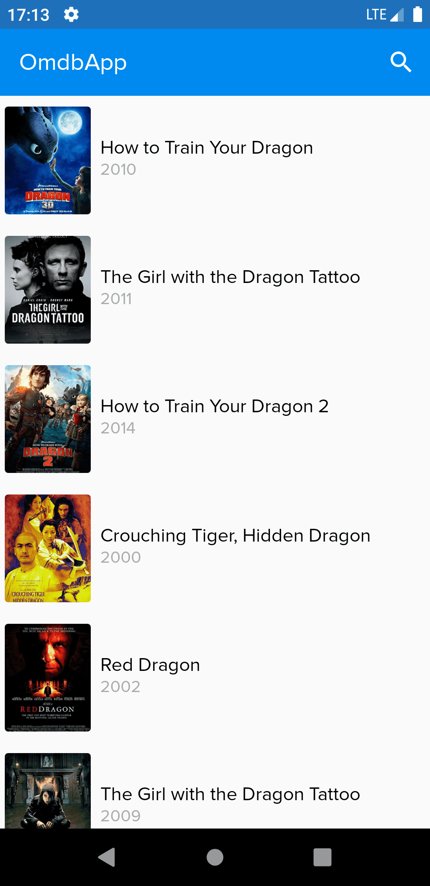
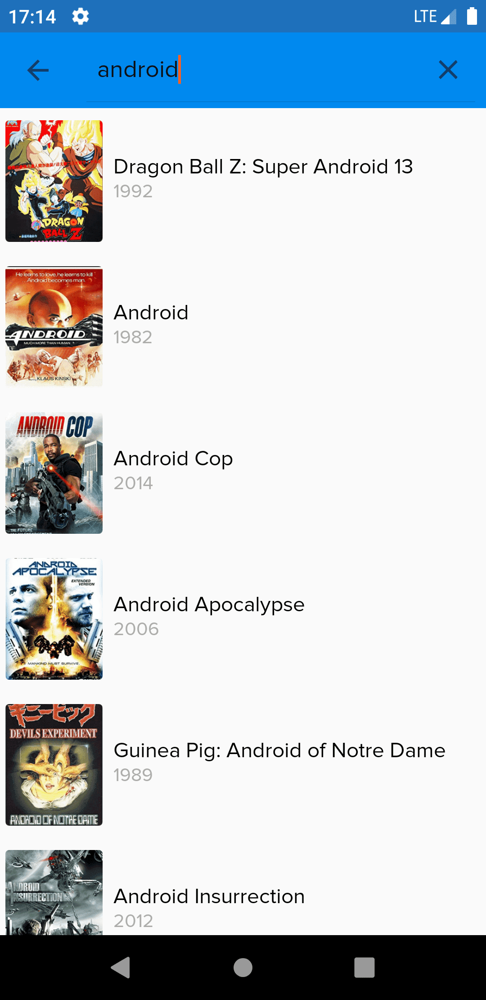
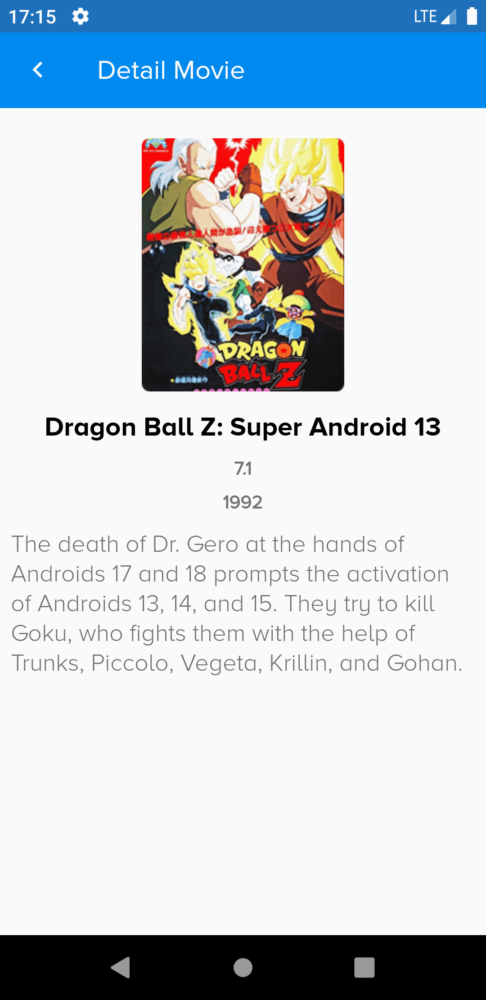

# Movie Apps
Consuming API from <a href ="http://www.omdbapi.com"> OMDB </a>

<h2> Images Preview </h2>

  

<h2> About this App </h2>

<ul>
  <li> Displaying movie app based on OMDB using MVVM design pattern</li>
  <li> using jetpack pro LiveData, ViewModel, Retrofit, Dagger</li> 
  <li> Support Load More listener for paging</li>
  <li> Using cpp to secure secret key from apk that been reversed engineered</li> 
</ul>

<h2> Reason </h2>

Reason why I'm using MVVM because its gonna be easier to implement the unit testing also 
modularity in code easier to maintain.

<h2> Feel free to download the apk </h2>  <a href ="http://www.omdbapi.com">Link APK</a>

<h2> Future Development Suggestion </h2>
<ul>
  <li>Implement Room for storing local data in android mobile, infact make it single source of data,
by using that, once device has connection for internet, data saved to local storage, and then display it to UI</li>
  <li>Implement Paging Android, which is already included in jetpack pro.</li>
  <li>Add new features in menus like save  or bookmark or maybe even like search by year or so on.</li>
</ul>

<h2>NOTES</h2>

If you would like to run this project using Android Studio please make sure to get your apiKey from <a href ="http://www.omdbapi.com"> OMDB </a> first. Once you get your <b>apikey</b> please edit this part :
        <ul>
        <li>go to this path <i><b>rootfolder / app / src / main / cpp / kotlin-jni.c</i></b></li>
        <li>change "insert_your_key_here" with your apiKey </li> 
        </ul>

Example: apikey = 12312412312

    return (*env)->NewStringUTF(env, "insert_your_key_here"):
    
change to

    return (*env)->NewStringUTF(env, "12312412312"):

